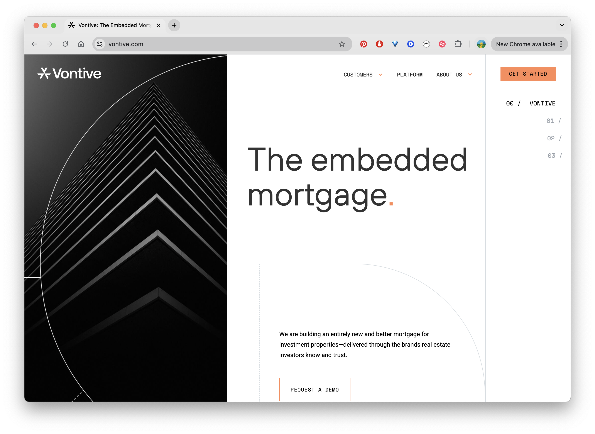
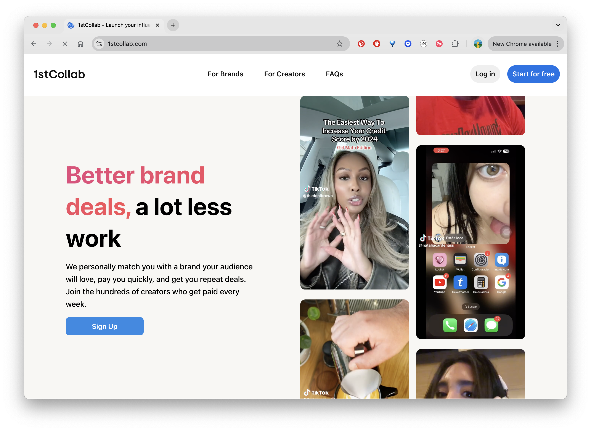
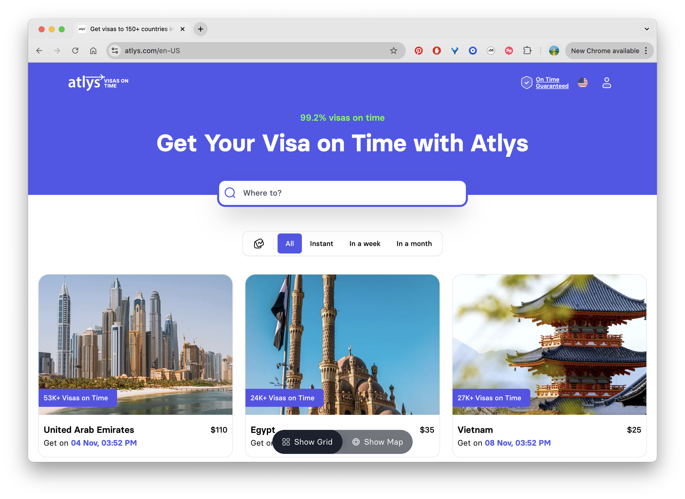

### A list of my private investments

**Canva** -- I consult for Canva, advising on their private search and personalization roadmap.

**Vontive** -- Vontive is building an entirely new and better mortgage for investment properties—delivered through the brands real estate investors know and trust. [Vontive recently raised their Series B](https://techcrunch.com/2022/04/07/vontive-wants-to-be-the-palantir-of-real-estate-investing/)

_I invested because (1) I have a ton of faith in Shreyas and (2) I was compelled by the process through which he identified this space and solution._

**Aedeate (Genova Labs)** - Bin & Andrew were senior eng leaders at Pinterest, where they led most, if not all, innovative AI/ML systems & products for Pinterest in the decade before they founded Aideate Inc. They have now built a powerful AI Platform + APIs on top of their own Proprietary Chat & Voice models and they are partnering ($1m+ contract) directly with a top Game Studio to deploy production ready AI agents into their existing and new games.

_I invested in them because they possess top end technical and product skills._

**Pace Groups** -- An online platform for group therapy sessions.

_I invested in Cat and Jack out of belief in their mission (therapy is a rapidly growing space), and out of respect for their own conviction in it._

**1stCollab** -- 1stCollab (YC W23) is an AI-powered influencer marketer built by the former Product Director of Discovery, Product Lead of Creator Engagement, and tech leads for the Home Feed and Ads Targeting teams at Pinterest. 1stCollab is NOT an influencer marketing platform. It is the first AI influencer marketer that can replace entire influencer marketing teams. 1stCollab leverages AI and a database of 10B+ influencer posts to perform 100x better than human influencer marketers and have helped brands like Framer save over $1M a year on influencer costs and Locket run campaigns that have reached over 100M views. https://brands.1stcollab.com/.

_Varun and Leon, the founders of 1st Collab, worked on my team at Pinterest. I invested in them because they, having worked in the creators space, had a sense of a large problem they deeply believed they could solve._

**Atlys** - [Atlys Visa](https://techcrunch.com/2021/10/28/atlys-raises-4-25m-to-make-visa-applications-faster-and-easier/) aims to make the world of travel simpler and more transparent. Mohak, the founder, worked on my team at Pinterest. [Atlas recently raised their Series B from Peak IV](https://www.business-standard.com/companies/start-ups/visa-processing-platform-atlys-raises-20-million-in-series-b-funding-124092301264_1.html).

_I invested in Mohak because he is a singular force, and he wanted to radically reinvent an experience (Visas) he hates._

**Thunkable** Thinkable builds no code solutions for SMBs to allow them to build apps (for commerce, engagement, etc.) ... without coding.

_I believe apps and experiences are just "content" and over time it is always true that more people can create more types of content, better. Those that make this true are often winners. From the creator perspective, everything that is true of words and paragraphs and pictures will also be true of coding and apps some day. I invested in Arun as his mission and vision directly align with this, and his early traction has been impressive._

**Gradient AI** Gradient is building a B2B AI solution to power complex workflows.

_Chris, the founder of Gradient, worked on my team at Pinterest. He was always a hustler, and had a nose for success._

**Rivian** I had the opportunity to invest in Rivian in 2018 (via Prysm Capital, whom I advise for). Rivian IPO'd Nov. 9 2021.

_I invested because the product was amazing._

Earlier in my career, I also invested in some of my batchmates in YC (**RapGenius** and **MedMonk**) and two other companies founded by friends **RunHop** (founded by Pete Davies who I met at Medium) and **LaunchBit** (founded by Elizabeth Yin who I've known since college and later as the cofounder of HustleFund!).

